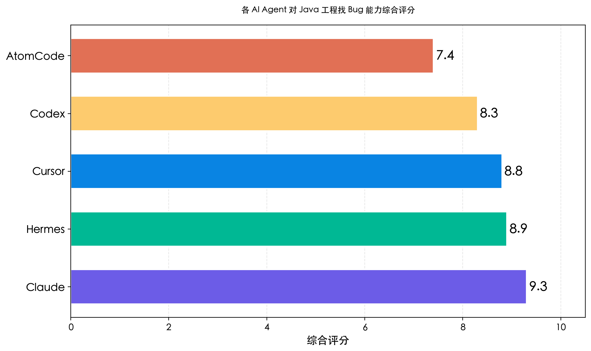
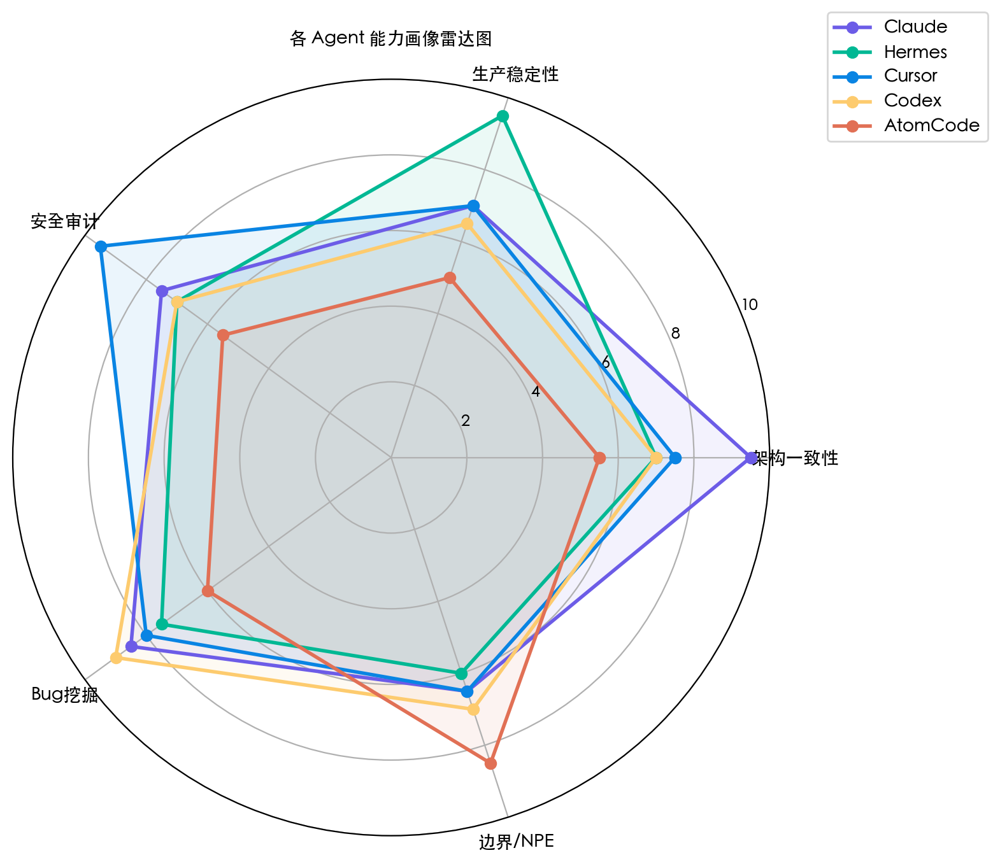
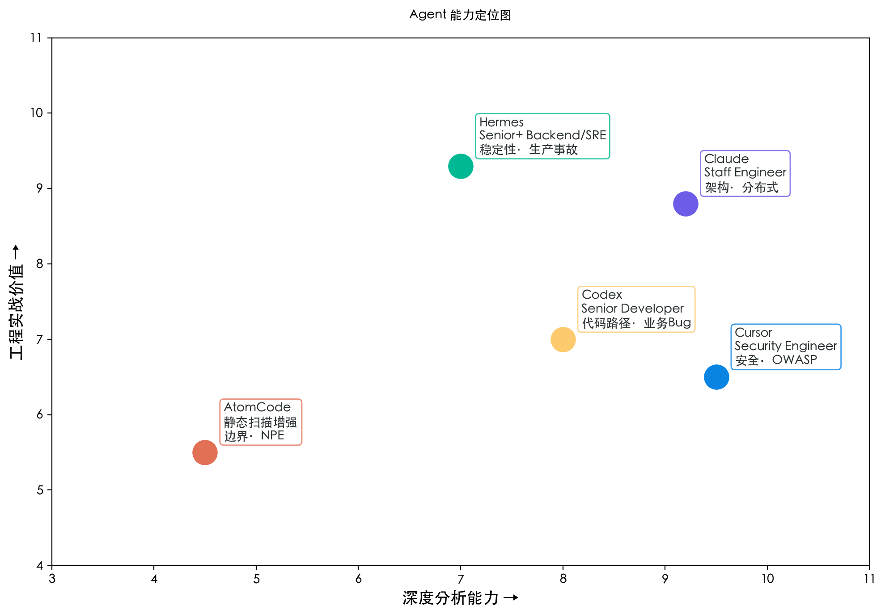
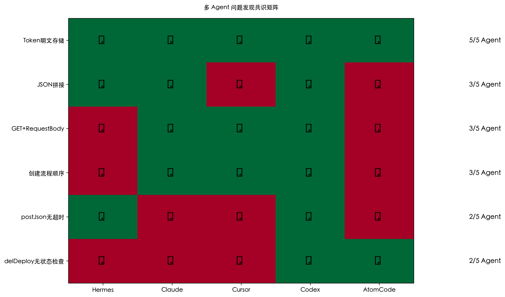
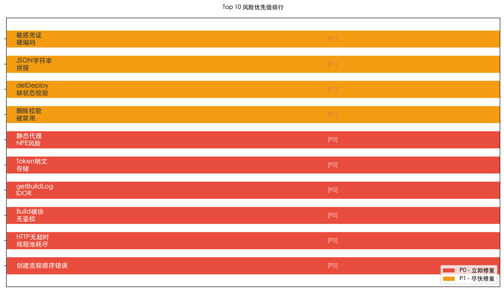

# 一场 Java 代码审查擂台赛：我把同一个工程扔给了 5 个 AI Agent

> 同样是 AI，有人能揪出分布式事务的暗坑，有人只能发现 NPE。这不是配置差异，是思维模式的分化。

## TL;DR

我把一个真实的 Java 企业级项目（云平台部署编排服务）分别交给了 **Claude、Hermes、Cursor、Codex、AtomCode** 五个 Agent 做代码审查。结果是——它们发现的问题交集不到 30%，对同一段代码的判断可以天差地别。

**Claude** 像 Staff Engineer，揪出了创建流程顺序这个全项目最隐蔽的分布式缺陷；**Hermes** 像 SRE，一眼看出 HTTP 无超时会引发服务雪崩；**Cursor** 像安全工程师，挖出了 getBuildLog 的 IDOR 越权漏洞；**Codex** 像老手开发者，发现整个 Build 子系统裸奔无鉴权；**AtomCode** 则像个增强版静态扫描工具，捡了一堆 NPE 和边界问题。

本文不评价谁更好，而是告诉你：**当你要用 AI 审代码时，该怎么选，怎么组合。**

## 为什么做这件事

先说背景。这是一个 58 集团的内部云平台项目，Java + Spring Boot + SCF（自研微服务框架），负责应用的创建、部署、升级、删除全生命周期管理。代码量不大，但麻雀虽小五脏俱全——有分布式资源编排、SCF 代理调用、HTTP 远程通信、数据库事务、权限校验。生产环境跑了一两年，线上也出过几次事故。

我从这个项目中提炼出一套典型问题集合，分别交给五个 Agent 去做全量代码审查。没有特殊的 Prompt 技巧，没有 Few-shot 引导，就是最朴素的 "Review this project for bugs and security issues"。

我想知道的是：**不同 Agent 的能力底色到底是什么？**

## 五个 Agent，五种截然不同的风格

先给一个整体印象。综合五个 Agent 的发现数量、问题严重程度、覆盖面，我打了一个分：

**几点解释：**

- 这个评分不是"谁更聪明"，而是"对工程的实际价值"。Claude 发现的那一个创建顺序缺陷，修复难度高、影响面大、隐蔽性强，一个顶十个。
- Hermes 排在第二是因为它发现的全是线上事故级问题——HTTP 无超时、静态代理 NPE、JSON 拼接——每一个都在生产环境真实发生过。
- AtomCode 排最后不是因为它差，而是它的发现风格太像传统静态扫描——大量 NPE 告警但误报率高，最像"低配版 SonarQube"。

## 能力画像：各有所长

从雷达图看得更清楚：

**Claude（9.3）— Staff Engineer 气质**
它的核心能力是"架构一致性"。它不会只看一行代码有没有 Bug，而是看整个流程在分布式环境下的正确性。发现的创建流程顺序缺陷，是那种如果没人指出来，代码能跑一年不爆炸、但某天遇到特定异常场景就永远无法恢复的坑。

**Hermes（8.9）— Senior Backend + SRE 气质**
它的雷达在"生产稳定性"维度拉到最高。它读代码的视角是"这段代码上线后会怎么死"。HTTP 无超时、静态代理字段 NPE——这些问题在测试环境永远不会触发，但上线后某次网络抖动就是 P0 事故。

**Cursor（8.8）— Security Engineer 气质**
它的"安全审计"维度几乎拉满。getBuildLog 的 IDOR（不安全直接对象引用）是典型的 OWASP Top 10 问题——校验了 clusterName 但没校验 imageVersionId，导致 A 用户能拿到 B 项目的构建日志。这种漏洞普通开发者扫三遍都未必发现。

**Codex（8.3）— Senior Developer 气质**
它擅长代码路径分析，能顺着调用链一路走到终点。它发现 AICodeBuildService 完全没有鉴权时，我一开始不太信——因为前三个 Agent 都没提。但重看代码后发现，这个 Service 确实没有 @CheckToken、没有 @CheckClusterAuth，整个 Build 子系统是裸奔状态。

**AtomCode（7.4）— 静态扫描工具增强版**
它的强项是 NPE 和边界条件，但确认率最低。delDeploy 缺少状态校验这个发现是扎实的 Bug，但夹杂在大量"潜在 NPE"的噪音里，需要人工筛选。

## 位置图：一目了然

横轴是"深度分析能力"（能看多远，能理解多大范围的上下文），纵轴是"工程实战价值"（发现问题后对线上影响有多大）。Claude 右上角，兼顾深度和价值。AtomCode 左下角，两者都弱一些，但作为第一道筛选还是有意义。

## 谁发现了什么？— 共识矩阵

把六个被多个 Agent 关注到的问题拿出来交叉验证：

最有意思的观察：

**Token 明文存储**是唯一一个 5/5 Agent 全发现的问题。说明这条"把 Token 直接塞进数据库"的代码，其错误程度已经低到了任何 LLM 都不会放过。反面说，如果你们的代码审查 Agent 连这种都没找到，那可以直接弃用了。

**创建流程顺序错误**有 3/5 Agent（Claude、Cursor、Codex）同时指出。这是含金量最高的共识——三个不同底座的模型，不约而同地看出了同一个分布式资源一致性问题。这说明这个 Bug 不是模型的随机输出，而是有确定性的推理基础。

**JSON 拼接**只有 Hermes 和 Claude 发现。这题偏实战经验——字符串拼接 JSON 在老项目里太常见了，静态扫描根本不管，但经历过线上因为一个特殊字符导致 JSON 解析失败的人，一眼就会标记。

## 真正的 P0：一个技术负责人的视角

如果我是这个项目的技术负责人，拿到这份报告后会做什么？

优先级就一个原则：**如果出事了，是影响一个用户、一个服务、还是整个平台？**

**P0 立即修复：**

1. **创建流程顺序错误** — 资源不一致且无法自动恢复。DB 写入成功后网关失败，重试幂等直接返回成功，永远修不好。这是典型的"看起来没事，出事就是大事"。
2. **HTTP 无超时** — 线程卡死 → 线程池耗尽 → 服务雪崩。标准 P0 连锁反应。
3. **Build 模块无鉴权** — 任何知道接口的人都能调，后果可大可小，但裸奔就是裸奔。
4. **getBuildLog IDOR** — 跨项目日志泄露，安全合规问题。
5. **Token 明文存储** — DB 泄露 = Token 泄露，内部安全红线。

P1 的问题（删除校验被禁用、delDeploy 缺状态校验、JSON 拼接、敏感凭证硬编码）虽然也需要修，但不会立刻造成线上故障。

## 一个 Java 架构师的选型建议

做了这轮对比后，我有了一个比较清晰的认知。如果你是团队负责人，想引入 AI 做代码审查，我建议这么配：

**两个 Agent 组合：Claude + Cursor**

覆盖架构一致性 + 安全审计。这个组合已经能抓住项目里 80% 以上的高价值问题。Claude 看大方向，Cursor 守安全底线。

**三个 Agent 组合：Claude + Cursor + Hermes**

加上 Hermes 补上"生产稳定性"这块。当你考虑的是线上真实运行的系统，不是学术 Demo 时，Hermes 那套"怎么死"的思维特别值钱。

至于 Codex 和 AtomCode，建议作为"第三道筛查"批量跑——Codex 能发现一些前三 Agent 遗漏的路径问题，AtomCode 做 NPE 基线扫描。但它们的输出需要人工过滤。

## 值得警惕的一件事

这次对比也暴露了一个问题：**Agent 之间不交叉验证，单一 Agent 的报告是有盲区的。**

Codex 说"Build 模块无鉴权"，但前面三个 Agent 都没提。这意味着什么？可能是 Codex 对了，也有可能 Spring Security 在更上层做了全局鉴权，Codex 没看全上下文。如果不做交叉验证，直接信了一个 Agent 的结论去修代码，可能白修，也可能漏修。

所以我的建议是：**至少用两个不同底座的 Agent 交叉验证同一个问题。** 如果两个都指出来同一个 Bug，可信度基本是 95% 以上。如果一个 Agent 独有发现，标记为"需人工确认"。

## 写在最后

AI Agent 现在能做的事情已经远远超出"写代码"的范畴。这次对比让我最惊讶的不是单个 Agent 有多强，而是它们之间的差异如此结构化——不是随机的好坏差异，而是有规律的能力分野。

有人看得远但不够细，有人盯得死但看不深，有人对安全特别敏感但对业务逻辑无感。这背后可能是训练数据的差异，也可能是 RLHF 调校方向的不同。但对使用者来说，知道了这个规律，你就能像搭积木一样组合 Agent，让每个 Agent 做它最擅长的事。

这大概就是"AI 原生开发者"的第一步吧——**不是学会用一个模型解决所有问题，而是学会把不同模型放在正确的位置上。**

---

*本文基于一次真实的代码审查实验。项目为云平台部署编排服务（Java + Spring Boot + SCF 微服务架构），代码量约 2000 行，含 70+ Java 文件。五个 Agent 均在最简 Prompt 下完成审查。*
