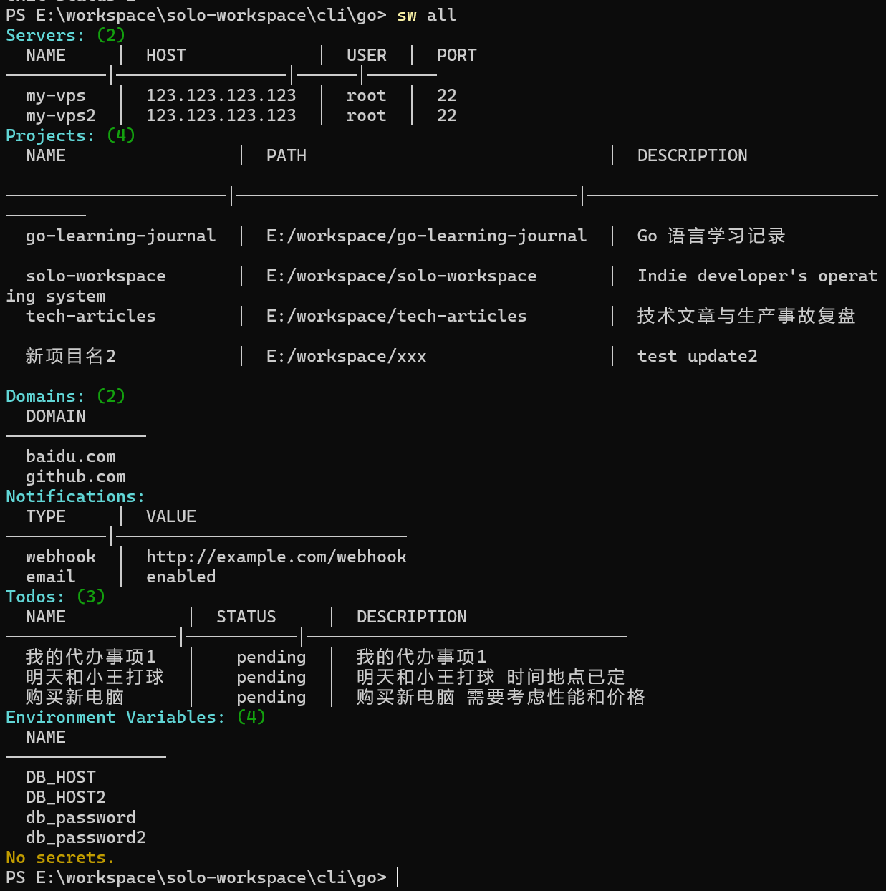
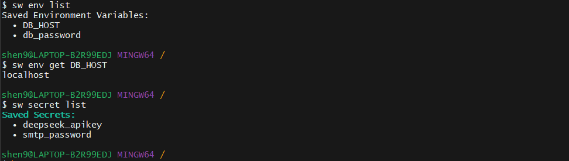
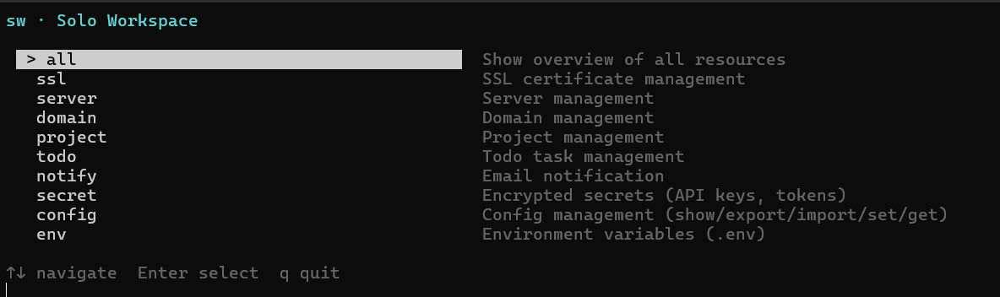
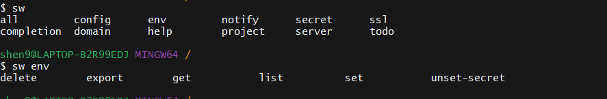

# 我受够了在项目、域名、服务器、SSL 之间来回切换，于是开源了 Solo Workspace

## 问题

做独立开发的时候，我发现每天都在不同工具之间来回切换：

- SSH 管服务器
- 浏览器查域名
- SSL 到期手动检查
- `.env` 到处都是
- API Key 散落各个项目
- Todo 写在便签和 Notion

每个单独拎出来都不算大事。但每天在这六七个工具之间跳来跳去，积累起来就是一种消耗——**脑子被碎片信息占满，真正写代码的时间反而少了**。

更糟的是，这些东西之间本该有关联：

> 这个 SSL 证书属于哪个域名？这个域名绑的哪台服务器？这个 stripe key 哪个项目在用？

但因为数据散落在不同地方，这些关联靠脑子记。一忙起来就会忘。

---

## 为什么做

时间久了以后，我开始想：

> 有没有一个工具能把这些东西统一起来？

不是"又一个平台"。不需要注册账号、不需要云同步、不需要 SaaS 订阅。

就是一个命令行工具，一份 YAML 配置文件，把服务器、域名、SSL、密钥、Todo 全部收进来。

于是有了 **Solo Workspace**。

---

## 解决方案

核心思路很简单：**一份配置，一个入口，全在终端**。

```bash
sw server add   my-vps --host 1.2.3.4      # 服务器管理
sw domain add   example.com                 # 域名管理
sw ssl check                                # SSL 证书检查
sw project add  my-saas --path ~/code/saas  # 项目管理
sw todo add     "修支付回调bug"              # Todo 管理
sw secret set   stripe_key "sk_live_xxx"    # 加密存储密钥
sw env set      DATABASE_URL "postgres://"  # 环境变量
sw all                                      # 一览全局
```

没有新概念要学。你本来就知道服务器、域名、SSL、密钥——只是以前它们散落着。现在一个 `sw` 命令全管了。

### 密钥加密

API Key 用 AES-256-GCM 加密存储，不是明文 `.env`：

```bash
sw secret set stripe_key "sk_live_xxx"
# 存入 ~/.solo/keys/，AES-256-GCM 加密，可设置密码
```

不解密的时候你的 key 就是一堆乱码。跟 `.env` 明文比，至少多了一层。

### 配置分层

```
sw -c /path/custom.yaml    ← 手动指定
~/.solo/config.yaml        ← 全局配置（跨项目）
./.solo.yaml               ← 单项目覆盖
```

大多数时候一个全局配置就够了。特殊项目在目录下放个 `.solo.yaml` 覆盖。

一份典型的 `~/.solo/config.yaml` 长这样：

```yaml
servers:
  my-vps:
    host: 123.123.123.123
    user: root
    port: 22

domains:
  - mysaas.com
  - sideproject.cn

projects:
  my-saas: ~/code/my-saas
  side-hustle: ~/code/side-hustle

todos:
  - 修支付回调 bug (high)
  - 续费 mysaas.com 域名 (mid)

notify:
  email:
    enabled: true
    host: smtp.gmail.com
    port: 587
    username: me@gmail.com
    password: app-password
    from: me@gmail.com
    to:
      - me@gmail.com
```

服务器、域名、项目、Todo、通知，一份文件全管。不需要额外数据库，不需要注册服务。

---

## 效果展示



`sw all` 看一眼所有东西——哪些 SSL 快过期了、哪些域名要续费、项目路径在哪、Todo 还剩多少。



密钥加密、环境变量集中管理。再也不用翻 `.env` 文件找那个 `DATABASE_URL` 了。



不想记命令？输入 `sw` 无参数进入交互菜单，上下键选。日常推荐还是用 CLI 命令 + Tab 补全：

```bash
sw completion install bash   # bash / zsh / fish / powershell
```



---

## 技术实现

### 插件架构

每个功能都是独立插件——乐高式，可拆可换：

```
cli/go/
├── cmd/                # CLI 入口（cobra）
├── internal/           # 配置、输出、通知
├── plugins/
│   ├── ssl/            # SSL 管理
│   ├── server/         # 服务器管理
│   ├── domain/         # 域名管理
│   ├── project/        # 项目管理
│   ├── todo/           # 待办管理
│   ├── notify/         # 邮件通知
│   ├── config/         # 配置导入导出
│   ├── env/            # 环境变量
│   └── secret/         # 加密存储
└── main.go
```

加一个新功能三步走：

1. 在 `plugins/<功能名>/` 下新建 `plugin.go`
2. 实现 cobra 命令
3. 在 `cmd/root.go` 里注册一行

不用到的插件完全不加载。想删某个功能？删目录就行，不影响其他。

### 为什么选 Go

- **单二进制**：`go build` 出来一个文件扔 `~/bin/` 就能跑，零依赖
- **跨平台**：同一套代码，Windows / macOS / Linux 全通。我在公司用 PowerShell，在家用 iTerm2，都能跑
- **Cobra 生态**：命令补全、子命令嵌套都是现成的
- **加密直接用标准库**：`crypto/aes` 搞定，不用装 openssl

之前也试过 Node.js，后来删了——不想为了一个 CLI 工具装 Node 运行时。纯 Go 是对独立开发者最友好的选择。

---

## 未来规划

| 版本 | 状态 | 内容 |
|------|------|------|
| v0.1 | ✅ | 插件架构、SSL、服务器/域名/项目管理、Todo |
| v0.2 | ✅ | 环境变量、密钥加密、TUI、Shell 补全 |
| v0.3 | 🔨 | 项目关联、成本追踪、SQLite 后端 |
| v0.4 | 📋 | Docker 集成、GitHub 集成 |
| v1.0 | 🚀 | Web 面板、插件市场 |

v0.3 考虑加 SQLite，因为 YAML 做单用户够用，但要查"这个 SSL 证书属于哪个域名、这个域名绑了哪台服务器"这种关联查询，还是得有数据库。

---

## 安装

```bash
git clone https://github.com/shenyb/solo-workspace.git
cd solo-workspace/cli/go
go build -o ~/bin/sw .
sw ssl check     # 快速验证
```

Windows（Git Bash 或 PowerShell）：

```bash
# Git Bash
cd cli/go && go build -o ~/bin/sw.exe .
# PowerShell
cd cli\go; go build -o "$env:USERPROFILE\bin\sw.exe" .
```

---

## 最后

Solo Workspace 不是什么宏大产品。它解决的是独立开发者每天都在踩的小石子——"Stripe 的 key 放哪了"、"那个域名还有几天过期"、"昨天加的那台服务器 IP 是什么"。

把碎片收拢，把重复操作交给命令行，把脑子留给真正重要的东西——你的产品。

**如果你也在被碎片化工具困扰，试试看。** 开源 MIT，欢迎 Star ⭐、Issue、PR。插件架构就是为了让你能轻松贡献新功能——三行代码注册一个插件，写完就是你的。

> GitHub: https://github.com/shenyb/solo-workspace
>
> 命令参考: [docs/command.md](https://github.com/shenyb/solo-workspace/blob/master/cli/docs/command.md)
>
> 路线图: [docs/roadmap.md](https://github.com/shenyb/solo-workspace/blob/master/cli/docs/roadmap.md)
