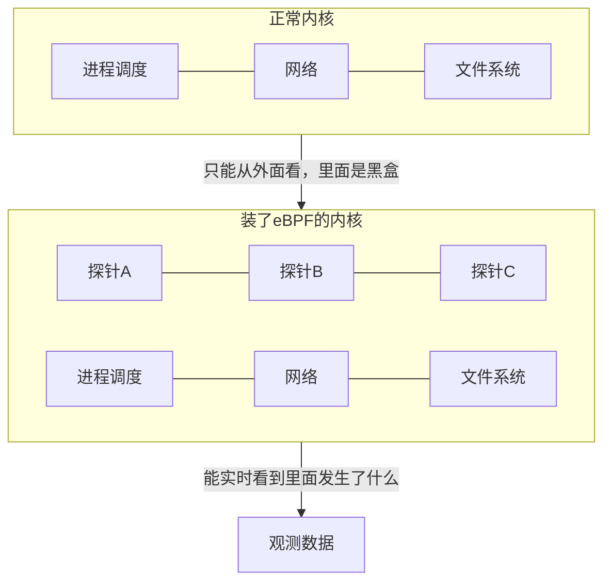
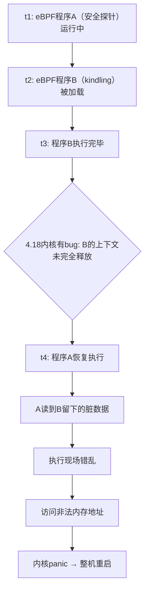

# eBPF 探针炸了 24 台服务器：CentOS 4.18 内核 eBPF 上下文清理 bug 复盘

> **TL;DR** 在测试集群部署了一个基于 eBPF 的观测工具（kindling），想看看性能数据。结果 24 台物理机内核崩溃重启，900 个 Pod 被连带重建。原因不是程序写得差，而是 CentOS 4.18 内核的一个深层 bug：两个 eBPF 程序同时运行时，后结束的那个会污染前一个的执行上下文，导致内核 panic。这事让我彻底改变了对 eBPF 的看法——它不是"装上就完事的黑盒探针"，而是一把在内核里运行的刀。

---

## 📌 本文要点

- **eBPF 跟普通监控工具的本质区别**：跑在用户态的程序挂了只崩自己，eBPF 挂了崩整个内核
- **4.18 内核的 eBPF 上下文清理 bug**——为什么重启一万次也治不好
- **多个 eBPF 工具的冲突问题**：Cilium、Falco、Kindling 各自为政，都不知道内核里还有别的探针
- **内核版本决定了 eBPF 的安全水位**，老内核上跑 eBPF 要有心理准备

---

## 🏗️ 背景与环境

| 项目 | 信息 |
|------|------|
| 集群类型 | 测试集群（jiagou_wcloud_offline_binhai） |
| 灰度机器数 | 31 台物理机 |
| 操作系统 | **CentOS 7（4.18 内核）** |
| 已有 eBPF 探针 | 安全部的安全检测探针 |
| 新部署工具 | **Kindling**（eBPF 观测工具） |
| 容器编排 | Kubernetes |

重点标记 **4.18 内核** 和 **已有 eBPF 探针**——这两个条件叠加，就是事故的导火索。

---

## 🔧 先搞懂：eBPF 到底是什么

eBPF（extended Berkeley Packet Filter）是 Linux 内核里的一项技术，允许你**在不改内核代码、不重启内核的情况下，在内核里跑一段小程序**。

你可以把它理解成给内核装**传感器/探针**：



eBPF 的常见用途：
- **观测/监控** — 看网络延迟、系统调用耗时，不需要装 agent 轮询 CPU
- **安全检测** — 实时拦截可疑的系统调用
- **网络加速** — 比如 Cilium 用 eBPF 替代 iptables 做容器网络

现在很多云原生基础设施已经在用 eBPF 了，你很可能被动地在用它——比如你的 K8s 集群如果用了 Cilium，那 eBPF 已经在你的内核里跑了。你只是不知道而已。

---

## 🌙 一个"测试工具"的部署

晚上九点。

我想在集群上试试 kindling 这个观测工具——它是基于 eBPF 的，能无侵入地观测网络延迟、系统调用等指标，很适合做性能分析。

我选的是测试集群，灰度了 31 台机器。

我以为这是在"安全地做测试"。

但我忽略了一个事实：**这个所谓的测试集群，跟线上用的是同一个内核。而且这个集群上已经跑着安全部的 eBPF 探针了。**

两个 eBPF 程序在同一台机器的内核里共存，我没有意识到有任何风险。

---

## 💥 部署四分钟后，机器开始崩了

部署后四分钟，第一台物理机内核崩溃重启。

然后第二台，第三台……两个小时内一共 **24 台物理机陆续内核 panic 重启**。

**900 个 Pod** 被牵连重建。测试环境的所有服务全部中断。

```mermaid
timeline
    title 事故时间线
    21:00 : 部署kindling到测试集群
    21:01 : 第一台物理机内核panic重启
    21:05 : 多台机器陆续崩溃
    23:00 : 累计24台物理机panic, 900 Pod重建
    23:xx : 安全部停掉一个eBPF探针, 崩溃停止
```

这就是 eBPF 跟普通程序最残酷的区别：

| | 普通程序 | eBPF 程序 |
|---|---|---|
| 运行位置 | 用户态 | **内核态** |
| 挂了影响 | 自己进程退出 | **内核 panic → 整机重启** |
| 连带影响 | 无 | 节点上所有容器全挂 |
| 调试难度 | strace/gdb 就能看 | 需要内核调试知识 |

**跑在用户态的监控工具，崩了重启一下就行。跑在内核态的 eBPF 探针，崩了带走整个节点。**

---

## 🔍 根因：4.18 内核的 eBPF 上下文清理 bug

追查的结果指向了 CentOS 4.18 内核的一个已知 bug。



要触发这个 bug，需要**两个条件同时满足**：
1. 内核版本是 4.18（或更早的版本）
2. 同时运行两个或以上的 eBPF 程序

两个条件都满足了。

---

## 🔄 重启一万次也没用

发现机器崩了之后，初步反应是——重启看看能不能恢复。

机器是重启了，然后……又崩了。

因为这不是一个"运行时状态被污染"的问题（比如内存泄漏，重启能清一下状态）。这是**内核代码本身的缺陷**——4.18 内核的 eBPF 上下文清理逻辑从根本上就是错的。只要两个 eBPF 程序同时加载、同时运行，这个 bug 就一定会被触发。**重启一万次也改变不了这个事实。**

实际上，最终恢复的方式也不是重启，而是**安全部直接停掉了其中一个 eBPF 探针**。直到某个探针被移除，崩溃才真正停止。

| Bug 层次 | 根因 | 重启能好吗？ |
|----------|------|------------|
| 应用层（内存泄漏、死锁） | 运行时状态污染 | ✅ 能，但会复现 |
| **内核层（eBPF上下文清理bug）** | **内核代码缺陷** | ❌ **不能，换内核或换配置才有效** |
| 硬件层（坏内存、坏磁盘） | 物理损坏 | ❌ 不能，换硬件才行 |

---

## 🤔 你以为只有一个 eBPF 程序在跑

我事后回想这件事，最让我后怕的一个问题是：**我在部署之前，根本不知道这台机器上已经跑着另一个 eBPF 程序。**

这不是我的疏忽，而是这类系统的普遍现状：

| 工具 | 用途 | 谁装的 |
|------|------|--------|
| Cilium | 容器网络（eBPF） | 云平台 |
| Falco / Tetragon | 安全检测（eBPF） | 安全部 |
| Kindling / Pixie | 观测 profiling（eBPF） | SRE / 开发 |

各自安装时都不知道对方存在。而且 eBPF 不像普通的进程——你用 `ps aux` 能看到。它是在内核里跑的，对用户态是完全透明的。不是你"忘了排查"，而是你**根本不知道要排查什么**。

多个 eBPF 程序在内核里共享 maps、hooks、程序链表，它们的隔离性在旧内核上并不完善。5.x 以上的内核在这方面做了很多改进，但 4.18 这种老内核——坦率地说——还活在 eBPF 的"西部时代"。

---

## 📊 内核版本决定 eBPF 的安全水位

不同内核版本的 eBPF 安全性差别很大：

| 内核版本 | eBPF 安全特征 | 比喻 |
|----------|--------------|------|
| 4.x（早期） | 基本可用，缺边界检查 | 开手动挡的车——老司机可以，新手容易出事 |
| 5.x | 验证器增强、BPF 链接机制 | 自动挡——安全很多，但仍然有边界情况 |
| 6.x | 可休眠 BPF、原子操作、更严验证 | 自动驾驶——接近生产安全水平 |

这次事故用的就是 4.18。

如果你的生产环境还在用 CentOS 7（3.10 或 4.18 内核），跑 eBPF 就要有"可能会崩"的心理准备。不是说不能跑——很多公司跑得好好的——但你需要补上对应的监控和应急手段。

---

## 🛠️ 怎么修的

定位到问题后，修复和预防分几步走：

### 1. 立即止血：停掉冲突的 eBPF 探针

安全部停掉了其中一个 eBPF 探针，崩溃停止。这是紧急恢复手段——不是长久之计，但先止血。

### 2. 升级内核版本

长期方案是将测试集群和线上集群的内核从 4.18 升级到 5.x+。5.x 内核的 eBPF 验证器更强，BPF 链接机制更完善，多程序共存的隔离性大幅改善。

### 3. 建立 eBPF 程序注册与发现机制

部署任何 eBPF 工具前，必须先查询当前节点上已有的 eBPF 程序列表。可以通过 `bpftool prog list` 和 `bpftool map list` 查看。我们把这个检查加到了部署流程的 pre-check 阶段。

### 4. 加内核 panic 告警

eBPF 崩了就是 kernel panic，但日志很容易被淹没在系统重启的噪音里。我们加了基于 `dmesg` 的 kernel panic 检测告警，重启后自动检查上次崩溃原因。

---

## 🔚 最讽刺的一个点

整件事最讽刺的地方在于：**kindling 本身是用来观测系统的，结果它自己搞崩了系统。**

我用一个观测工具看系统性能，结果这个观测工具本身变成了系统的问题。

这让我想到一句话：

> 在分布式系统里，**观测链路本身也是系统的一部分。**
>
> 你的监控探针可能比你监控的服务更危险——
> 因为它有更大的权限（内核态），
> 有更低的可见性（不暴露在进程列表里），
> 有更少的测试（大部分 eBPF 工具在 CI 里跑的都是用户态模拟，不是真正的内核环境）。

---

## ✅ 复盘 Checklist：部署 eBPF 工具前过一遍

- [ ] **当前内核版本是多少？** 低于 5.x 要格外小心
- [ ] **这台机器上已经有什么 eBPF 程序在跑了？** 用 `bpftool prog list` 查
- [ ] **停掉这个探针，我有恢复手段吗？** eBPF 崩了就是 kernel panic
- [ ] **如果它崩了，我怎么知道是它崩的？** 加 kernel panic 检测告警
- [ ] **测试集群的内核版本跟线上一样吗？** "测试"不等于"安全"
- [ ] **多个 eBPF 工具之间有冲突风险吗？** 老内核上隔离性不完善

eBPF 是把好刀，但它是一把在内核里转的刀。**确认刀刃不会脱手之前，别急着开机。**
