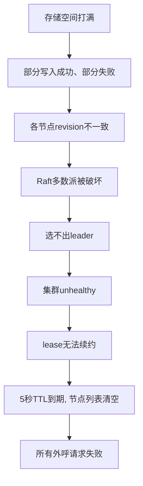

# etcd Revision 爆炸外呼瘫痪复盘：4000 万条历史版本撑爆 8GB 存储

> **TL;DR** 一个下午，外呼服务突然全线瘫痪，602 个坐席打不了电话。追了 24 分钟才发现，原因不是什么代码 bug 或网络故障，而是 **etcd 的 lease 续约没开自动压缩，4000 万条历史版本撑爆了 8GB 存储**。更绝望的是，等我们发现时已经恢复不了了——扩容没用、压缩拒绝执行、备份也恢复失败。最后只能把用户切回老系统。这篇文章是我对整件事的复盘。

---

## 📌 本文要点

- **一个 `--auto-compaction-retention` 参数没配**，如何让 etcd 无声地走向死亡
- **etcd 存储写满后为什么扩容都救不回来**（Raft 一致性的一个常见误解）
- **为什么"做了备份"不等于"灾难时能恢复"**
- **我们对 lease 续约频率的反思**——有些"最佳实践"其实需要重新审视

---

## 🏗️ 背景与环境

| 项目 | 信息 |
|------|------|
| etcd 版本 | 3.x |
| etcd 存储限制 | **8GB**（默认 quota-backend-bytes） |
| 拨打节点数 | 10 个 |
| lease 续约频率 | **1 次/秒**，TTL = 5 秒 |
| 自动压缩 | ❌ **未开启** |
| 影响范围 | 602 个灰度坐席无法拨打电话 |

重点标记 **未开启自动压缩** 和 **1次/秒续约频率**——这两个条件叠加，就是 revision 爆炸的根因。

---

## ☎️ 一个坐席打不出电话的下午

下午两点五分，告警群突然炸了。

**"外呼异常！灰度用户无法拨打！"**

我快速看了一眼监控——外呼服务的所有拨打节点全部失联。没有断网，没有宕机，但 etcd 里可用的节点列表就是空的。

外呼服务的逻辑很简单：拨打节点启动时向 etcd 注册自己，然后每隔 1 秒续约一次（lease TTL=5 秒）。外呼服务收到拨打请求时，从 etcd 拉取可用节点列表，选一个来执行拨打。

**节点列表为空，意味着所有拨打请求都会失败。** 602 个灰度用户在那一刻打不出任何电话。

当时的第一反应是：etcd 挂了？先排查看看。

---

## 🔍 第一眼：etcd 不可写

查 etcd 集群状态——unhealthy。再细看，etcd 的 8GB 存储**满了**。

不是被什么大文件撑满的，而是被 **4000 多万条 revision 信息**填满的。

这里需要先解释一个 etcd 的特性。

---

## 💡 先搞清楚：etcd 的 revision 是什么

etcd 每次数据变化，都会生成一个全局递增的版本号叫 **revision**。这个版本号不是"覆盖旧值"，而是追加一个新的历史版本——类似 Git 每次 commit 都会生成一个新 hash，而不是覆盖上一个 commit。

我们的拨打节点每 1 秒续约一次 lease，每次续约就是一次写入，每次写入就产生一条新 revision。

做个算术：

```
1 个节点 × 1 次/秒 × 3600 秒 × 24 小时 = 每天 86,400 条 revision
如果有 10 个节点同时续约 → 每天 86.4 万条
运行几个月 → 4000 万条 revision → 8GB 撑爆
```

**etcd 不自动清理旧 revision，它们就像日志一样只增不减。** 而我们的集群**没有开启自动压缩**（auto-compaction）。

一条配置就能防住的事：
```
--auto-compaction-retention=1h
```
只保留最近 1 小时的 revision，其他定期清理。但我们没配。

---

## 🔗 连锁反应：存储满了 → 全部崩盘

存储满了不只是"写不进去"这么简单。对 etcd 这种分布式共识系统来说，存储满意味着：



从"存储快满了"到"全线瘫痪"，中间没有任何人能感知到——没有告警，因为没有监控磁盘使用率。

---

## 🔧 艰难（且失败）的恢复尝试

我们开始尝试恢复。每一步都让人更绝望：

```mermaid
timeline
    title 恢复尝试时间线
    14:05 : 发现etcd存储满, 集群unhealthy
    14:12 : 重启etcd节点 → 失败, 空间依然满
    14:15 : 执行数据压缩 → 拒绝, unhealthy状态无法执行
    14:20 : 扩容磁盘8G→16G → 节点启动后仍unavailable
    14:25 : 用备份数据恢复 → 失败, 备份未验证过
    14:29 : 切回老系统, 坐席恢复
```

**第一步：重启 etcd 节点。** 不行。重启不会清理历史 revision，空间依然满，集群依然 unhealthy。

**第二步：执行数据压缩。** 等于是说"etcd，请把旧的 revision 删掉"。但 etcd 回复："抱歉，我现在 unhealthy，没法执行管理操作。"——**已经 unhealthy 了才想压缩，晚了。**

**第三步：扩容磁盘，8G → 16G。** 空间够了吧？重启节点。节点进程起来了，显示"available"……过一会儿又变成"unavailable"。

这里有个很多人的误解。我们以为扩容 = 加空间 = 恢复。但对 etcd 来说，**空间够了不等于数据对得上**。

三个节点的 revision 在存储打满的那段时间里已经变得不一致了。扩容给了更大的存储空间，但三本账本的数据还是对不上。Raft 拒绝接受：你不能拿一本跟别人不一样的账本当 leader。所以节点虽然能启动，但在 Raft 层面它无法加入集群，永远 unavailable。

**第四步：用备份数据单节点启动。** 我们做过备份，定期跑 `etcdctl snapshot save` 导出的文件。拿出来恢复——也失败了。

**"做了备份"和"备份能恢复"是两回事。** 备份文件可能已经损坏了，也可能太旧了恢复出来节点列表是空的。关键在于——**我们从来没验证过备份能不能恢复**。它在磁盘上躺着，大小正常，看起来一切良好，但到用的时候才发现不行。

**第五步（无奈之举）：切回老系统。** 我们放弃了恢复，把所有灰度部门切回旧的外呼系统。坐席重新扫码，恢复正常。**恢复耗时 24 分钟。**

---

## 🛠️ 怎么修的

定位到问题后，修复和预防分几步走：

### 1. 开启自动压缩（治本）

```bash
--auto-compaction-retention=1h
```

只保留最近 1 小时的 revision，定期清理。一条配置，防住整类问题。

### 2. 加磁盘使用率告警（预警）

etcd 磁盘使用率 > 75% 立刻告警，到了就人工介入压缩。**别等 unhealthy 了再救。**

### 3. 降低 lease 续约频率（减负）

从 1 秒一次改为 10 秒一次，TTL 从 5 秒改为 30 秒。对外呼系统来说，30 秒知道一个节点挂了和 5 秒知道，没有本质区别。但 etcd 写入压力降了 90%。

| 方案 | 写入频率 | etcd 压力 | 发现节点挂的时间 |
|------|---------|-----------|----------------|
| 1s 续约 / 5s TTL | 1 次/秒/节点 | 高 | 最多 5 秒 |
| **10s 续约 / 30s TTL** | **0.1 次/秒/节点** | **低 90%** | **最多 30 秒** |

### 4. 定期验证备份可恢复（兜底）

每个月选一台测试机器，跑一遍完整的 `restore + 启动 + 数据校验` 流程。如果 restore 脚本在演练中挂掉了，那不是"浪费时间"，而是避了一次灾。

---

## 💭 事后复盘：我学到的东西

### 1. 一行配置没配，4000 万 revision 就来了

回头看，整件事最憋屈的地方在于：**一条配置就能防住。**

```
--auto-compaction-retention=1h
```

就这么一行。而且 etcd 的官方文档里写得清清楚楚。但它不像 MySQL 的 `auto_increment` 那样人尽皆知，**revision 在 etcd 里是个隐形的磁盘消耗者**——你看不见它在涨，它也不报错，直到某一天空间满了。

我现在看任何一个新接入的系统，第一件事就是问：**哪些数据是"只增不减"的？它们的清理策略是什么？**

### 2. 存储满了的 etcd，比挂了更可怕

分布式系统和单机系统最大的区别之一是：**单机系统挂了就是挂了，你知道该修；分布式系统可能会进入一种"半死不活"的状态，让人不知道该怎么下手。**

```
MySQL 磁盘满：
  → 抛错 "disk full"
  → 清理空间 → 重启 → 恢复 ✅

etcd 磁盘满：
  → 部分写入成功、部分失败
  → 各节点数据不一致
  → Raft 多数派破坏
  → 集群 unhealthy
  → 此时想压缩 → 拒绝执行
  → 扩容 → 数据还对不上
  → 备份 → 没验证过恢复不了
  → ❌ 等你发现的时候，自救已经晚了
```

### 3. 验证备份能不能恢复，比做备份更重要

"我们每天凌晨跑 snapshot save，备份文件都在。"

这话我以前也信。但这次事故之后，我的感受是完全不一样的：

```
备份流程：
  crontab 每天执行 snapshot save
  → 文件写入 /backup/ 目录
  → 磁盘空间监控显示文件存在、大小正常
  → 所有人都觉得"我们有备份了"

实际上没验证过：
  这个文件真的能用 etcdctl restore 恢复吗？
  恢复出来的数据是不是完整的？
  恢复后服务能不能正常启动？
```

### 4. 高频不一定是好事

这次事故的触发源头之一是 lease 续约频率——1 秒一次。最初可能觉得"越快越好，节点挂了能尽快感知"。但后果呢？每次续约都是 etcd 的一次写入，每条写入都是 revision 的一次增长。

**高频不一定是好事，觉得"越快越好"时，算算它对下游的影响。**

---

## 🔚 写在最后

事故过去之后，我一直觉得这件事挺讽刺的。

一个运行了几个月都没问题的系统，因为一行配置没配，在某个下午突然崩了。崩了之后还救不回来，因为 etcd 的设计让它陷入了一致性死锁。连备份都不管用，因为从没人试过。

**一行配置、一个磁盘告警、一次恢复演练——任何一个环节做了，这次事故都不会发生。但三个环节都没做，它就精确地踩中了。**

---

## ✅ 复盘 Checklist：搭建 etcd 集群前过一遍

- [ ] **`--auto-compaction-retention=1h` 配好了吗？** 一行配置防住整类问题
- [ ] **磁盘使用率 > 75% 有告警吗？** 别等 unhealthy 再救
- [ ] **lease 续约频率合理吗？** 不是越快越好，算算对 etcd 的写入压力
- [ ] **备份能恢复吗？** 定期验证 restore 流程，而不是只做 snapshot save
- [ ] **哪些数据是"只增不减"的？** 它们的清理策略是什么

都是小事。但有时候，崩掉一个大系统的，就是这些小事。
