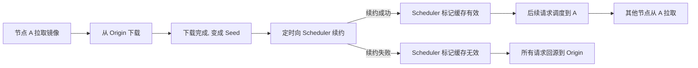

# 交换机故障后 2000 容器起不来：Dragonfly P2P 缓存雪崩复盘

> **TL;DR** 凌晨两点，一台交换机故障导致 100 多台物理机断网，3600 个容器被触发迁移。按理说容器迁移后从 P2P 缓存拉镜像应该很快恢复，但结果 2000 个容器挂了一个多小时起不来。追查发现：P2P peer 节点的续约机制一直有个 bug，containerd 环境下获取存活容器失败导致缓存被清空。但这个 bug 在日常负载下根本看不出来——它一直潜伏着，等交换机故障来把它点燃。

---

## 📌 本文要点

- **P2P 缓存系统最脆弱的时候恰恰是最需要它的时候**——一个本应分担压力的机制，自己先崩了反而把压力全转嫁给 origin
- **一些 bug 在 99.9% 的时间里是"无害"的**，只在极端条件下才暴露。如何提前发现它们？
- **告警不是给"错误"加的，是给"假设"加的**——代码没报错不代表系统没问题
- **混沌工程/故障演练的尴尬现实**：最有价值的场景往往最难演练

---

## 🏗️ 背景与环境

先交代一下我们的环境，方便你判断和自己的情况是否相似：

| 项目 | 信息 |
|------|------|
| 集群规模 | 数百台物理机 |
| 容器运行时 | **containerd**（从 Docker 迁移过来不久） |
| P2P 镜像分发 | **Dragonfly**（蜻蜓） |
| 容器编排 | Kubernetes |
| 镜像仓库 | 自建 Harbor |

重点标记 **containerd**——后面你会发现，它是整件事的隐性导火索。

---

## 🌃 凌晨两点，电话响了

凌晨两点二十分。

我被电话吵醒——值班同事打来的："云平台大面积宕机告警，几百台物理机断网了。"

我翻身起来，打开电脑，监控面板上一片红色。

事后我才知道，是某台物理**交换机故障**了，导致下属 117 台机器全部断网。Kubernetes 检测到节点失联，开始自动驱逐 Pod——**3600 个容器**在短短几分钟内被触发迁移，分散到其他健康的节点上。

这是一个标准的故障恢复流程：节点坏了 → 容器移到别处 → 重新拉镜像 → 启动。流程没错。

但问题出在下一步。

---

## ⏳ 半小时过去了，容器还没起来

断网的交换机十分钟左右就修好了，但云平台上还有大量容器处于 **Pending** 状态。

不是一两个，是大约 **2000 个**。

容器 Pending，意味着**镜像拉取失败**了。但我们用的不是普通的镜像拉取——我们部署了 P2P 镜像分发系统（蜻蜓 / Dragonfly），它的作用就是在这种大规模并发拉取场景下分担压力。

按道理，3600 个容器迁移到新节点后：
1. 节点从 P2P peer 拉镜像 → 缓存命中 → 秒级完成
2. 先拉完的节点变成新的 seed → 再分发给别人
3. 镜像仓库（origin）只承担少量首次拉取的压力

结果那天实际发生的是：

**所有请求都直接回源到镜像仓库了。**

仓库的网络带宽瞬间被打满，响应速度急剧下降。一个几十 MB 的镜像，平时几秒拉完，那天要等好几分钟。2000 个容器就这么卡住了。

**P2P 跑了，但跟没跑一样。**

---

## 🔍 追查：P2P 的缓存去哪了

仓库拥塞逐渐缓解后，容器开始慢慢恢复。但问题没解决——我们要搞清楚：**P2P 的缓存去哪了？**

### P2P 分发系统的工作流程

先说清楚 Dragonfly 的工作原理，不复杂：



关键在于那个**续约机制**（lease / keepalive）。Peer 节点定期向调度中心报告"我还活着，我的缓存是有效的"。如果续约失败，调度中心认为这个节点已经死了，把它的缓存标记为无效。

### 续约一直在失败

我们查了 peer 节点的日志，发现了问题。

具体原因有两个，叠在一起：

**1. containerd 环境兼容性问题**

续约逻辑会调用 `getRunningContainers()` 获取当前节点上存活的容器列表。这个函数在 Docker 环境下通过 Docker SDK 调用，一切正常。但我们从 Docker 迁移到 containerd 后，这段代码没有适配——containerd 的容器查询走的是另一套 API（`ctr` 或 containerd client），原代码的调用路径实际上什么也没拿到，**返回了空列表**。

**2. 镜像仓库鉴权问题**

续约时 peer 需要向镜像仓库验证缓存中镜像的有效性（确认镜像还没被覆盖或删除）。但这个验证请求携带的鉴权 token 在 containerd 环境下的生成逻辑有差异——Docker 通过 `~/.docker/config.json` 获取凭证，containerd 走的是自己的凭证链（通过 containerd client 的 credential provider）。我们在续约逻辑中遗漏了 containerd 的凭证获取路径，导致请求被仓库 **403 拒绝**。

两个问题叠加的效果：

当 containerd 返回空容器列表时，peer 节点想的是：
> "哦，这个节点上没有容器在运行了，那我的缓存没有意义了。清掉吧。"

它"正常地、正确地"执行了清空缓存的逻辑。

然后继续向调度中心报告："我没有缓存了。"

于是所有后续的镜像拉取请求，调度中心都无法分配到 peer，**全部打到 origin**。

### 事故时间线

整件事的时间线如下：

```mermaid
timeline
    title 事故时间线
    02:20 : 交换机故障, 117台机器断网
    02:22 : K8s驱逐Pod, 3600容器触发迁移
    02:30 : 交换机修复, 网络恢复
    02:35 : 2000容器仍Pending, P2P缓存已清空
    02:40 : 仓库带宽被打满, 响应超时
    03:30 : 仓库拥塞缓解, 容器逐步恢复
```

注意：交换机 10 分钟就修好了，但容器恢复用了**一个多小时**——瓶颈不在网络，而在 P2P 缓存已经没了。

---

## 🧊 最让人后背发凉的事实

这个 bug 不是当天才引入的。**它已经潜伏了好几个月。**

为什么没人发现？

因为日常负载下，**单个节点的镜像拉取请求，直接回源也能扛住**。仓库带宽绰绰有余，速度只是慢了那么一两秒。谁也不会注意到一两秒的延迟。

只有当天凌晨那种——3600 个容器同时迁移、同时拉镜像——才把这个 bug 暴露出来。

| 场景 | 表现 | 结论 |
|------|------|------|
| 日常 1 个 Pod 重启 | 拉镜像慢 2 秒，启动正常 | "没事，网络波动" |
| 5 个 Pod 同时重启 | 慢 10 秒，运维可能注意到了 | "仓库有点慢，再看看" |
| **3600 个容器迁移** | **2000 个挂 1 小时** | **事故！** |

**同一个 bug，只是压力不同，表现从"完全无感"跨越到"重大事故"。**

我后来想到一个类比：

> 你家水龙头一直在滴水，但厨房的排水够快，你从来没注意过。
> 某天你同时开了三个水龙头，水槽来不及排了，水漫厨房。
> 你骂的是"水槽太小了"，但其实**水龙头一直在滴水才是根因。**

---

## 🛠️ 怎么修的

定位到问题后，修复分三步走：

### 1. 修复 containerd 兼容性 — 让续约拿得到容器列表

原来 `getRunningContainers()` 内部硬编码了 Docker SDK 调用。修复方式是根据当前容器运行时类型做判断：

- Docker 环境 → 继续走 Docker SDK
- containerd 环境 → 改用 containerd client 的 `ListContainers()` API，通过 namespace 过滤出 K8s 管理的容器

核心就是补上 containerd 的调用路径。修完之后续约逻辑在 containerd 下能正确获取存活容器列表，不再误判为空。

### 2. 修复鉴权问题 — 让缓存验证请求通过

在续约逻辑中补上 containerd 的凭证获取路径——通过 containerd client 的 credential provider 获取镜像仓库的认证凭证，确保验证请求能正确携带 token。修复后续约时的仓库验证请求不再被 403 拒绝。

### 3. 加上兜底：续约失败不清缓存

上面两步是修 bug 本身。但光修 bug 不够——万一以后再出类似的续约失败，我们不想再经历一次缓存雪崩。所以加了一层防御：

- 续约失败时，**不清空缓存**，而是标记缓存状态为"待验证"（stale）
- "待验证"状态的 peer 继续提供下载服务，同时后台异步重试续约
- 设置一个 TTL（我们定为 10 分钟），超过 TTL 仍未续约成功才真正清空缓存
- 对于镜像正确性问题："待验证"缓存提供的镜像可能不是最新版，但用旧版镜像启动容器，总比容器一直 Pending 要好。在紧急恢复场景下，**可用性优先于一致性**

---

## 🤔 如果当时有这些监控指标

事故复盘时我们想：有没有什么办法能在事故发生前就发现这个问题？

答案是有的——**如果我们监控了 P2P 系统的关键指标的话。**

当时我们监控了什么：节点状态（活的/死的）、仓库可用性（通的/不通的）、API 错误率。所有指标的共同特征——**它们都在监控"有没有报错"**。

但这次事故里，没有任何一行代码报错：
- 续约函数返回了 ✅（只是返回了一个错误的值）
- 缓存清空逻辑执行了 ✅（因为"没有存活容器"）
- 回源请求发出了 ✅（只是太多了把仓库打慢了）
- 仓库在正常响应 ✅（只是慢了，没挂）

**没有任何环节抛异常，但系统整体来看，结果是一团糟。**

所以正确的问题不是"有没有报错"，而是**"有哪些隐式假设，我们有没有监控它们是否成立"**。

| 隐式假设 | 应该加的告警 |
|----------|-------------|
| "peer 节点的续约一直能成功" | **续约成功率**（< 99% 立刻排查） |
| "大部分请求由 peer 缓存服务" | **缓存命中率**（< 50% 立刻排查） |
| "回源流量很少" | **回源比例**（正常 < 10%，飙到 > 30% 告警） |
| "镜像仓库带宽够用" | **仓库出入带宽利用率**（> 80% 告警） |

如果当时有缓存命中率的监控，我们会发现——peer 节点其实几个月来**一直在清空缓存**，缓存命中率长期接近零。问题在一个月前就该被发现了，不会等到交换机故障来揭盖子。

**能想到的假设都要加告警，而不是等代码报错。**

---

## ⚡ 越关键的东西，越难演练

事故报告里有一条改进措施："每个季度做一次故障演练"。

这个建议本身没错，但执行起来有一个骨感的现实：

- 演练**应用层**（杀掉一个 Pod）→ 安全、好做
- 演练**基础设施层**（模拟 100 台机器断网、压满仓库带宽）→ 如果环境不隔离，可能直接影响线上
- 再建一套完全隔离的演练环境（独立的镜像仓库、独立网络拓扑、完整集群）→ 成本高昂

所以大多数故障演练只做**安全的那些**。真正有杀伤力的场景——大规模容器漂移、仓库被打满——反而没人敢做。

**直到真正的故障替你做了。**

这也是故障演练的悖论：你越想去演练的（因为风险最大），越不敢演练（因为影响面太广）。但这个悖论必须打破——哪怕一年做一次，也远比等到线上真出了事再复盘要好。

---

## 💭 续约保活：最脆弱的分布式假设

这次事故的核心是一个看起来再合理不过的设计：

> 节点定期向调度中心报告"我还活着"。如果没收到报告，就认为它死了，清理它的缓存。

这个设计本身没有错。问题在于它是一个**"要么全有要么全无"**的假设：
- 续约成功 → 一切正常 ✅
- 续约失败 → 缓存全清，压转给 origin ❌

没有中间状态，没有降级路径。

在这次事故中，我们实际落地了"待验证 + 异步重试"的降级策略（见上面的修复部分）。核心思路就是：

> **续约失败了？不清缓存。标记为"待验证"，给一个宽限期，继续提供服务，后台重试。**

**"尽量服务，降级退让"——比"全有或全无"更鲁棒的设计哲学。**

---

## 🔚 写在最后

这次事故最终靠"等待仓库拥塞自行缓解"恢复的。没有人为干预，没有紧急修复——就是等，等了快一个小时，请求处理完了，容器自然启动了。

听起来有点讽刺。但有时候故障恢复就是这样——你能做的事情在故障发生前就已经做完了（或者没做）。

---

## ✅ 复盘 Checklist：上线分布式组件前过一遍

- [ ] **核心假设列出来了吗？**（续约成功、缓存命中、网络可达……）
- [ ] **每个假设被击穿时的降级路径想清楚了吗？** 有没有"全有或全无"的设计？
- [ ] **假设不成立时有没有告警？** 不是等代码报错，是监控假设本身是否成立
- [ ] **这个组件在 10x 负载下会怎样？** 有没有做过压力测试？
- [ ] **故障演练计划里有没有覆盖基础设施层的场景？** 哪怕一年做一次
- [ ] **容器运行时切换后，依赖它的组件都验证过了吗？** Docker → containerd 的坑不止这一个

以及最重要的问题：

> **这个 bug，在出事之前我能发现它吗？**
>
> 如果答案是不能——那就说明我的监控在监控错误的东西。
