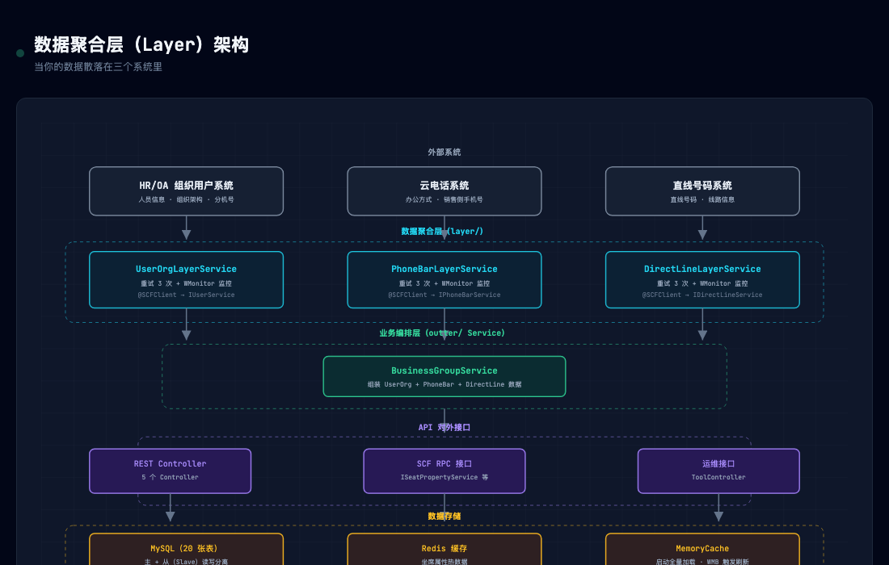

# 一个坐席的数据散落在三个系统？用数据聚合层统一收口

> 你负责的系统需要从三个不同的外部服务查询数据才能拼出一个完整的对象？
> 每次加字段都要搞清楚"这个字段从哪个系统来"？
> 某个外部系统挂了，你的接口也跟着挂？

如果中了任意一条，这篇文章可能对你有用。

---

## 📌 本文要点

- **场景**：坐席（客服）的属性数据散落在 HR 系统、云电话系统、直线号码系统，查一次完整信息要调三个 RPC
- **问题**：散落的调用导致代码重复、容错缺失、难以维护
- **解法**：加一层数据聚合层（Layer），每个外部系统对应一个 Layer Service，统一做重试 + 监控 + 容错
- **适用**：任何需要聚合多数据源的场景

---

## 一、背景：一个坐席的信息，为什么要问三个系统？

几个月前，我需要替换一个旧的坐席属性管理平台。

所谓"坐席属性"，就是客服人员在工作时需要的各种配置信息：分机号、直线号码、工号、办公方式、销售手机号……

听起来就是一个对象的事，对吧？

但现实是，这些数据**分别属于三个不同的系统**：

| 数据 | 归属系统 |
|------|---------|
| 员工姓名、部门、组织架构、分机号 | 🏢 HR/OA 系统 |
| 办公方式（在家/在公司）、销售侧手机号 | 📞 云电话系统 |
| 直线号码、线路信息 | 🔗 直线号码系统 |

查询一个坐席的"完整档案"，需要**串行调用三个独立 RPC 服务**，然后把结果拼到一起。

---

## 二、最直接的做法：散落在各处

最直觉的实现方式是——在业务代码里，需要什么就调什么：

```java
// 在某一个 Controller 里
public SeatPropertyVO getSeatProperty(String userId) {
    SeatPropertyVO vo = new SeatPropertyVO();

    // 调 HR 系统 —— 可能失败
    UserInfo userInfo = userService.userInfo(userId);
    vo.setUserName(userInfo.getUserName());

    // 调云电话系统 —— 可能失败
    String saleNum = phoneBarService.getHomeTypeMobile(userId);
    vo.setSaleNum(saleNum);

    // 调直线系统 —— 可能失败
    DirectLine line = directLineService.directLine(userName);
    vo.setDidNum(line.getLineNumber());

    return vo;
}
```

代码很短，看起来没什么问题。

但一旦项目变复杂，这种写法就会暴露出几个隐患：

1. **散落** —— 每个 Controller、每个 Service 里都可能出现类似的调用，没有统一入口
2. **没有容错** —— 任何一个 RPC 超时，整个请求就挂了
3. **没有重试** —— 网络抖动一下，直接返回失败
4. **没有监控** —— 不知道哪个外部系统经常出问题
5. **新人难上手** —— "这个字段从哪儿来的？"得翻半天代码

## 三、更糟的情况：你甚至不知道数据从哪里来

如果只是散落，还勉强能忍。

更可怕的是——随着业务迭代，数据源会变。比如：

- 分机号管理从 HR 系统迁移到了专门的号码管理系统
- 办公方式换了一个新服务

没有统一的数据聚合层，每次变更都要去**所有调用处**改代码。改漏一个就是线上事故。

---

## 四、解法：加一层（Layer 模式）

我们的方案很朴素——**加一层**。

```java
// 统一的数据聚合层，每个外部系统一个 Service
service/layer/
├── UserOrgLayerService.java       // 对接 HR/OA 系统
├── PhoneBarLayerService.java      // 对接云电话系统
└── DirectLineLayerService.java    // 对接直线号码系统
```

每个 Layer Service 只干一件事：**封装对一个外部系统的所有调用**。

### 标准实现：每个 Layer 都长这样

```java
@Service
@Slf4j
public class UserOrgLayerService {

    // 通过 RPC 框架注入外部服务
    @SCFClient(lookup = IUserService.URL)
    private IUserService userService;

    public UserInfo getUserInfo(String userId) {
        return getUserInfo(userId, 3);  // 默认重试 3 次
    }

    private UserInfo getUserInfo(String userId, int retry) {
        try {
            // 1. 调用外部系统
            CommonResult<UserInfoResponse> res = userService.userInfo(req);

            // 2. 正常返回
            if (res.isSuccess() && res.getData() != null) {
                UserInfo userInfo = new UserInfo();
                BeanUtils.copyProperties(res.getData(), userInfo);
                return userInfo;
            }
        } catch (Exception e) {
            log.error("getUserInfo 失败, userId={}, retry={}", userId, retry, e);

            // 3. 重试耗尽 → 打监控 → 返回 null（不抛异常）
            if (retry <= 0) {
                WMonitor.sum("layer.user_info.fail", 1);
                return null;
            }
            return getUserInfo(userId, --retry);
        }
        return null;
    }
}
```

三个 Layer 的代码结构几乎一样，区别只在于：**调用的外部系统不同、返回的 DTO 不同**。

### 这样做有什么好处？

**1️⃣ 调用者不关心数据从哪里来**

业务代码只需要一行：

```java
UserInfo userInfo = userOrgLayerService.getUserInfo(userId);
```

至于这个数据是从 HR 系统来的、从缓存来的、还是从本地内存来的——调用者不关心。哪天换了数据源，改这一个文件就行。

**2️⃣ 容错统一处理**

所有 Layer 都有 3 次重试 + 监控打点。不会出现"这个接口忘了加重试"的情况。新加一个 Layer 照着模板写，不会漏。

**3️⃣ 故障隔离**

某个外部系统挂了，不会拖垮整个服务。Layer 重试 3 次后返回 null，上游业务可以用缓存数据、用默认值——而不是直接抛 500。

**4️⃣ 便于扩展**

后来需要加一个工号管理的外部数据源，新建一个 `WorkNumLayerService` 就行了。不影响现有逻辑，也不需要改 Controller。

---

## 五、流量路径

```
请求 → Controller → 业务编排层
                      │
            ┌─────────┼─────────┐
            ▼         ▼         ▼
       layer/      inner/      impl/
     (外部系统)    (业务逻辑)   (DB 查询)
            │         │         │
            ▼         ▼         ▼
       外部系统     本地逻辑   MySQL + Redis
       SCF 调用              (本地缓存)
```


*各层之间的数据流向与依赖关系*

---

## 六、踩过的坑

### 1. 重试次数统一未必合理

所有 Layer 默认重试 3 次。但有些操作（比如分机号分配）涉及分布式锁，重试时锁如果没处理好反而会出问题。

**教训：** 读操作可以大胆重试，写操作要谨慎。

### 2. 外部系统挂了，业务方不知道

Layer 重试失败后默默返回 null，调用方可能没意识到数据缺失了。

**补救：** 加了兜底机制——连续失败超过阈值发告警，同时从本地缓存返回上一次成功的数据，不让前端拿到空值。

### 3. 缓存刷新依赖消息可靠性

我们用了两层缓存：本地 MemoryCache（启动时全量加载）+ Redis。外部系统的数据变更通过消息总线通知本服务，触发缓存刷新。

但如果消息丢了，缓存就和实际数据不一致了。

**补救：** 运维接口支持手动刷缓存，外加定时全量同步的兜底任务。

---

## 七、总结

"数据散落在多个系统"是企业级应用里很常见的问题——你不可能把所有人的数据都搬到一个库里。

Layer 模式的核心思路很简单：**不要在每个业务逻辑里重复写外部系统调用，收拢到一层，统一做容错、重试、监控**。

它不是什么精妙的架构设计，只是一个朴素的"加一层"思路。但正是这一层，让后来的人改代码时少了很多"这个字段到底从哪来的"疑惑。

---

如果你也有类似的场景——数据散落在多个系统之间、每次查数据都要调好几个接口——不妨试试 Layer 模式。

欢迎在评论区聊聊你是怎么做数据聚合的 🐾

---

*文章中的代码做了脱敏处理，架构图 HTML 版本见 [GitHub 仓库](https://github.com/shenyb/tech-articles)*
