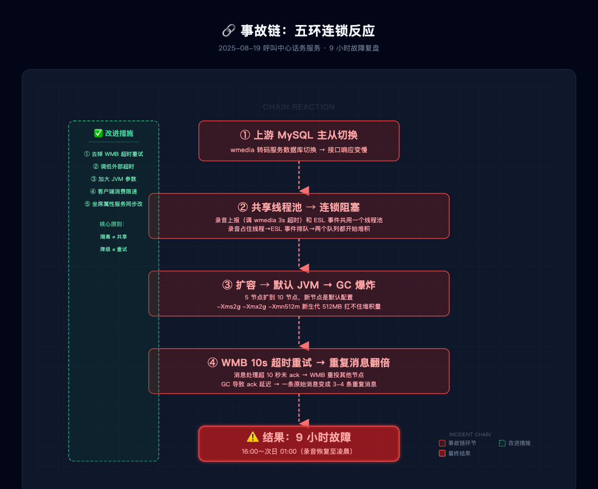

# 一次 MySQL 主从切换，话务服务崩了 9 小时？这串连锁反应我复盘了很久

> **TL;DR** 2025 年 8 月的一个下午，上游转码服务的 MySQL 主从切换，引发了我负责的话务服务长达 9 小时的推送延迟。表面看是接口超时，但真正致命的是：**共享线程池 → 默认 JVM → WMB 自动重试** 这三颗雷连环引爆，差点把整个服务炸穿。这篇文章是我以第一人称梳理的完整复盘。

---

## 📌 本文要点

- 一个外部接口超时，如何通过共享线程池锁死整个服务
- 默认 JVM 参数在消息堆积场景下有多脆弱
- WMB 自动重试配置如何让事情雪上加霜
- 我们最后改了哪几处关键代码

---

## 🌪️ 一个普通的周一下午

2025 年 8 月 19 日，下午四点。

我正盯着 IDE 写下一期的需求，突然手机震了——告警群：**"调用 wmedia 转码接口超时"**。

wmedia 是我们依赖的录音转码服务，话务服务的核心链路依赖它：FreeSWITCH 产生的 ESL 事件和录音上报事件，由我们的线程池处理，录音上报时会调 wmedia 接口做转码。当时第一反应——wmedia 挂了，等他们恢复就好。

但没想到，这只是雪崩的第一片雪花。

---

## 🔗 第一环：上游 MySQL 主从切换 → 接口超时

wmedia 那边回复很快：MySQL 主从切换，导致接口响应变慢，一部分请求超时了。他们 16:12 重启服务，自认为恢复了。

这个层面上看，问题好像已经解决了。但真正的地狱，从 16:40 才开始。

---

## 🔗 第二环：共享线程池——最隐蔽的坑

16:40，告警又响了。这次是 **ESL 事件堆积**。

我打开监控一看，头皮发麻——WMB 主题 113931 的消费进度基本不动了。

问题出在哪？话务服务的设计里，**ESL 事件处理和录音上报处理共用一个线程池**。为什么这么设计？因为同一个通话的 ESL 事件和录音事件需要保证有序，如果分两个线程池处理，可能会出现 ESL 事件先到、录音后到但被抢先消费的情况。

这个设计在正常情况下没问题。但录音上报会调用 wmedia 转码接口——**接口设置了 3 秒超时**。当 wmedia 变慢时，这 3 秒就成了一个移动路障：

```
录音上报 → 调 wmedia（等 3s 超时）→ 线程被占住 3s
ESL 事件 → 等线程池空 → 也排 3s
下一个录音 → 继续等 3s
```

一个线程池，两种任务，一种任务被上游卡住，另一种也跟着遭殃。**这不叫"共享"，这叫"连坐"**。

---

## 🔗 第三环：默认 JVM 配置——新节点反而成了累赘

发现问题后，我们立刻扩容，从 5 个节点扩到 10 个。

结果堆积不仅没消下去，反而……嗯，更慢了？

排查日志，发现新节点疯狂 GC。原因很朴实：**新机器用了默认 JVM 参数**。

```
-Xms2g -Xmx2g -Xmn512m
```

新生代只有 512MB。在正常流量下够用，但面对堆积的海量消息——每个消息都要反序列化、处理、再序列化——512MB 的新生代分分钟被填满，频繁 Full GC，CPU 全花在 GC 上了，消息一个都处理不完。

我当时脑子里蹦出一句话：**"打仗的时候招新兵，结果新兵连枪都端不稳。"**

回头想想这是很典型的疏漏：我们评估了**正常场景的并发量**，但没有评估**堆积场景的突发并发量**。两者的差距不是一倍两倍，可能是几十倍。

---

## 🔗 第四环：WMB 自动重试——补刀最狠的一环

这还没完。

WMB 有一个配置：消息消费超时 10 秒就会自动重投，让别的节点再消费一次。

想象一下这个场景：

1. 节点 A 拿到消息，处理到第 8 秒，GC 了
2. WMB 看没在 10 秒内 ack，超时了，把消息重投
3. 节点 B 拿到，处理到第 5 秒，线程池满了
4. WMB 超时，再重投给节点 C
5. 节点 C……

结果就是：**一条原始消息变成了三四条重复消息**，全塞在一个队列里。原始堆积还没消化完，重复消息又翻倍了。雪上加霜？这是雪上加冰雹。

---

## 🔗 第五环：重试主题也来凑热闹

wmedia 的超时时间我们设置的是 10 分钟重试——也就是说，调 wmedia 超时后，这条消息扔进重试队列，10 分钟后再试。

这本身没什么问题。但**重试主题的消息也走同一个线程池**！结果就是：正常消息、重试消息、重复消息……全挤在一个池子里，谁也跑不掉。

从 16:00 到 18:30，我们经历了两个半小时的扩缩容、重启、调参，才慢慢把堆积消化完。而录音文件的恢复，一直持续到凌晨。

---

## 📊 整件事的连锁反应图



从 wmedia 的 MySQL 主从切换开始，五环连锁反应一气呵成：

```
MySQL 主从切换
    ↓
wmedia 接口超时（3s）
    ↓
共享线程池阻塞 → ESL 事件堆积
    ↓
扩容 → 新节点默认 JVM → GC 爆炸
    ↓
WMB 10s 超时重试 → 重复消息翻倍
    ↓
恢复正常时间：9 小时
```

每一步单独看都是小问题，串在一起就成了灾难。

---

## ✅ 我们改了哪些东西

事故之后，我和 team 一起梳理了改进措施，主要改了这几点：

**① 去掉了 WMB 超时重试配置**
这不是解决根本问题的办法。如果服务真的处理不过来，重试一百次也没用，只会让系统更堵。去掉后，重复消息的问题直接消失。

**② 调低外部 SCF 接口超时时间**
3 秒太长？改成更短的超时，并且要考虑超时后的降级策略——比如跳过转码、先处理 ESL 事件，录音后面再补。

**③ 调大 JVM 参数**
根据堆积场景重新评估，把新生代调大。而且要在部署脚本里固定好，防止新节点用了默认配置。

**④ 客户端消费限速**
在代码里加了一个滑动窗口限速，当堆积量超过阈值时主动降速，给下游和自己喘息的空间。

**⑤ 坐席属性服务也跟着改了**
和话务服务共用类似的架构模式，同样的坑不能再踩一次。

---

## 💭 复盘反思

复盘完了，说几句心里话。

**第一，没有孤立的上游故障。** 任何一个依赖方出问题，最终都会以某种形式传导到你的服务。不做好隔离，就在给别人背锅。

**第二，"共享"要考虑故障场景。** 共享线程池在设计时只考虑了"正常时序"的对称性，没有考虑"一个任务拖慢全体"的不对称性。现在看来，应该把 ESL 事件和录音事件拆成不同的线程池，中间用有序队列做缓冲。保持有序，但不互相阻塞。

**第三，默认配置是给 Demo 用的。** 生产环境永远不要用默认 JVM 参数。这一点我本来就知道，但还是被现实教育了一次。后来我们改成了每次上线前必须检查 JVM 参数。

**第四，重试要有上限，更要有退避。** WMB 的 10 秒超时重试，本质是"再试一次就好了"的乐观假设。但对堆积场景来说，再试一次大概率还是不行。重试策略应该是：快速失败 → 记录 → 异步补偿，而不是在同一根绳子上反复勒。

---

说到底，这次事故没有一个"神仙 Bug"——没有诡异的并发问题，没有复杂的数据竞态。只是一连串普通的配置和设计，在特定的压力场景下被放大了。

但正因为普通，才更值得记录下来。**每个"正常情况"下看似合理的决定，都可能在"异常情况"下变成致命的一环。**

你怎么看这个事故链？你们遇到过类似的情况吗？欢迎在评论区聊聊。

---

*2025-08-19 事故复盘 · 申*
