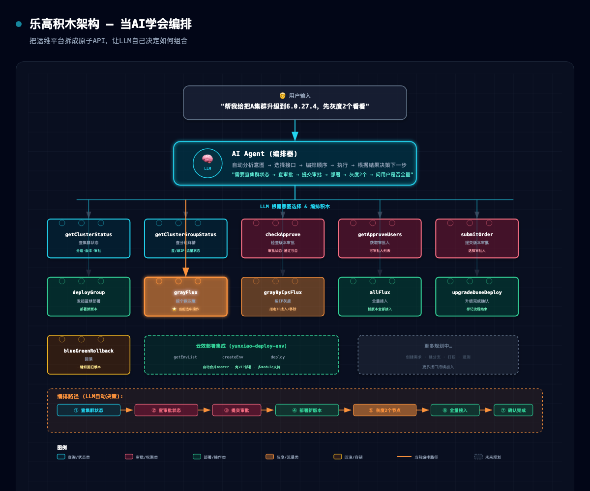

# 当AI学会编排：我把运维平台拆成了"乐高积木"

## 序

最近在公司内部做了一件有意思的事：把一个完整的蓝绿发布流程，拆成了11个互不依赖的API接口。然后让AI大模型自己去决定"什么时候调用哪个、怎么组合"。



结果出乎意料地好用。

用户只需要说一句"把集群A升级到6.0.27.4"，AI就会自动走完：查集群状态→查审批→提交审批（或跳过）→发起部署→灰度→全量接入→确认完成。

这背后不是写死的脚本，不是大量的if-else，而是一套"乐高积木"式的设计思路。

---

## 一、从痛点说起

过去几年，我一直在维护公司的云平台上层应用。提到运维工具的研发，最普遍的模式是：

**人想清楚每个流程 → 写成固定脚本 → 每次复用**

这带来了几个经典痛点：

**场景爆炸**。蓝绿升级有全量升级、按IP灰度、按个数灰度、回滚、仅审批…… 每种场景都要写一个不同的入口或分支逻辑。想象一下，如果每个用户说"我想升级，但只想先上2个节点看看"，你就要在代码里预判加一个 `grayByCount()` 方法。下一个用户说"我想只上这几个IP"，再加一个 `grayByIps()`。场景无穷无尽，脚本越积越多。

**差一点点就崩**。脚本处理的是"预期内的流程"。一旦中间某个环节的返回不符合预期——比如审批突然多了一个需二审、灰度中间卡住了——脚本要么崩溃，要么需要人工介入补丁。

**运维逻辑写死在代码里**。工具是写死的，只有研发人员能改。用户想要一个新的上线策略，得排队等排期。

---

## 二、灵机一动：让AI来当"流程大脑"

直到大模型的能力开始渗透到日常工具链，我改变了一个核心思路：

> **与其手写每一个流程，不如把能力拆成原子API，让LLM自己编排。**

类比一下：
- 传统的运维脚本 = 一本固定的食谱（只能做出固定的菜）
- 原子API + LLM = 一个食材超市（你自己选食材组合成任意菜式）

我们来看具体是怎么做的。

### 案例：蓝绿升级Skill

蓝绿升级是我做的第一个"乐高化"尝试。

我拆了11个API接口，每个只做一件事：

| 接口 | 职责 |
|------|------|
| `getClusterStatus` | 查集群状态 |
| `getClusterGroupStatus` | 查分组状态 |
| `checkApprove` | 查版本审批状态 |
| `getApproveUsers` | 获取审批人列表 |
| `submitOrder` | 提交审批 |
| `deployGroup` | 发起蓝绿部署 |
| `grayFlux` | 按节点个数灰度 |
| `grayByIpsFlux` | 按IP列表灰度 |
| `allFlux` | 全量接入流量 |
| `upgradeDoneDeploy` | 标记升级完成 |
| `blueGreenRollback` | 回滚 |

每个接口都是**纯粹的、无状态的**：传入参数，返回结果，不依赖上下文。

LLM接收到用户的意图（比如"把A集群升级到6.0.27.4，先灰度2个看看"），它会**自动做两件事**：

1. **选择**：从11个接口中选出需要的（查集群→查审批→提交审批→部署→灰度）
2. **编排**：决定顺序、参数映射、条件分支（如果审批已通过则跳过提交、如果灰度成功则询问是否全量）

这就是"乐高积木"模式——**接口是积木块，LLM是搭积木的人**。

### 为什么这比写死脚本更好？

**拥抱不确定性**。如果某个环节返回了意料之外的结果（比如"审批需要二审"），LLM会把它理解为"条件变化"，然后重新规划路径。脚本只能沿着固定路径走，而LLM有推理能力。

**零开发成本适配新场景**。用户说"只升级B分组的最新版本、但不切流量"，如果脚本没写这个分支就凉了。但LLM看到接口签名和返回数据后，自己就能决定：`deployGroup` → 不调`grayFlux` → 结束。**不需要改一行代码**。

**接口复用**。`getClusterStatus` 这个接口，在蓝绿升级里用、在例行巡检里用、在故障排查里也用。同样的接口，不同的LLM场景。

---

## 三、设计原则：什么样的接口才算是"好积木"？

通过几个月的实践，我总结了几个关键原则：

### 3.1 粒度要"原子"

判断粒度是否合适的标准很简单：**这个接口能不能被其他场景直接复用？**

好的例子：
- `checkApprove(version)` — 检查版本审批状态。蓝绿升级用，上线审批也用，日常巡检也用。
- `getClusterGroupStatus(cluster, group)` — 查分组实时状态。升级用，排查也用。

不好的例子：
- `doBlueGreenDeploy(cluster, group, version, grayCount, fluxMode)` — 一个接口干了太多事。其他场景无法复用这个接口。

### 3.2 认证和权限下沉到接口层

所有接口统一走 token 认证，不在接口里区分"这是管理员接口、那是普通用户接口"。认证是统一的，权限由接口响应的数据结构决定。

例如，`getApproveUsers` 返回的审批人列表，是空数组还是列表，本身就在告诉LLM"这个版本有没有可审批的人"——而不是用一个"无权限"的错误码来打断流程。

### 3.3 返回足够的信息让LLM做决策

每个接口的返回格式都包含充分的结构化信息，而不是一个干巴巴的 `{code: 1, msg: "成功"}`。

比如 `getClusterGroupStatus` 返回：
```json
{
  "status": "分组处于蓝绿中，新版本：6.0.27.4，全部运行，且未接入流量",
  "blueIps": [{"podIp": "10.25.45.207", "inFlux": true}, ...],
  "greenIps": [{"podIp": "10.25.62.154", "inFlux": false}, ...]
}
```

LLM 看到这些数据，自然知道：
- 如果所有greenIps的inFlux都是false → 应该先灰度
- 如果部分true部分false → 应该继续灰度剩下的
- 如果全是true → 下一步是全量

**不需要额外写规则。**

### 3.4 错误处理也是信息

脚本时代的错误处理是"兜底"——出错就停止、抛出异常。

在LLM编排的模式下，错误本身也是决策依据。

`deployGroup` 返回 `{code: 0, msg: "VIP数量不足"}` 时，LLM会主动问用户："当前VIP配额不足，是否愿意不使用VIP再次部署？" 用户说"可以"后，LLM会自动重试（带 `vipFlg: 0` 参数）。

类似地，部署前如果发现分支不是最新代码，LLM会自动拉取master合并后再重试——这个逻辑不在代码里写死，而是交给LLM根据错误描述推理出"应该合并代码再试"。

---

## 四、从蓝绿到平台：把更多场景"乐高化"

有了蓝绿升级的成功经验，我开始把同一套方法论推广到更大的范围。

### 云效部署链路

公司内部有云效平台，负责CI/CD流程。传统做法是：开发者在云效页面上手动选环境、配参数、点部署。

现在我们把这条链路也拆成了小接口：

| 接口 | 职责 |
|------|------|
| `getEnvList` | 查可用环境列表 |
| `createEnv` | 新建环境（沙箱/测试） |
| `deploy` | 触发部署（含异常处理） |

单看这三个接口很简单。但组合起来，LLM能完成的流程比脚本丰富得多：

- "部署到测试环境" → `getEnvList` → 用户选 → `deploy`
- "没有测试环境，帮我建一个然后部署" → `createEnv` → `deploy`
- "部署失败说VIP不够" → 询问用户 → `deploy`(带vipFlg=0)
- "部署失败说要合并master" → git merge → `deploy`

所有的"意外处理"，都变成了LLM的自然语言推理，而不是写在代码里的 try-catch。

### 更大的蓝图

现在正在规划把整条研发链路都"乐高化"：

```
提需求 → 创建分支 → 本地开发 → 规范检查 → 代码提交 →
打包构建 → 部署测试 → 测试通过 → 蓝绿/滚动上线
```

每一个环节都暴露一组原子API。当AI Agent能够理解整条链路时，用户只需要说一句"帮我把这个需求上线"——剩下的，由AI自己调用每个环节的接口完成。

把流程的控制权从代码交给AI。

---

## 五、一些思考

### 这不是"自动化的终结"，而是"自动化的另一种形态"

传统自动化追求的是**确定性**——写死每一步，不出错。但代价是**灵活性的丧失**。

LLM编排追求的是**灵活性**——不写死路径，让AI根据实时状态动态选择。代价是需要更高的接口质量（清晰的返回、合理的设计）。

两者不是替代关系。对于高频、固定的操作（比如"每天凌晨2点全量"），传统脚本依然是最佳选择。但对于**低频、多变、需要判断**的操作（比如"先灰度看看"），LLM编排的优势非常明显。

### 真正的工作量不在AI，而在接口设计

很多人以为"AI Agent"的难点在模型选型、prompt工程。但从我们的实践来看，**真正决定Agent好不好用的，是你暴露的工具体系设计得怎么样**。

- 接口粒度对不对？
- 返回数据够不够结构化？
- 认证是否统一？
- 错误描述是否对LLM友好？

把接口设计好了，LLM自然就能"用好"。设计得不好，再强的模型也救不了。

### 未来：每个平台都值得一个"AI层"

我越来越相信一个趋势：**未来每个运维平台、每个中间件、每个内部系统，都应该有一层为LLM设计的API**。

不再是"人用的界面"和"脚本调用的接口"两套东西，而是统一暴露小粒度的原子API，让AI Agent成为真正的"入口"。用户面对的不再是复杂的平台界面，而是一个会说人话的助手。

这就像当年SQL取代了手动文件操作——不是消灭了数据库，而是让"查数据"这件事变成了一条简单的语句。AI Agent正在做同样的事：把"运维操作"变成一句话。

---

## 六、写在最后

蓝绿升级的Skill上线后，团队内部反馈出乎意料——使用门槛大幅降低，之前需要培训才能操作的蓝绿发布，现在新同学直接说"帮我升一下"就能完成。

而这个模式最有意思的地方是：**当我把第12个接口加进去的时候，不需要改任何流程代码**。LLM会自动发现新接口，并把它纳入自己的决策空间。这才是"可扩展"的真正含义。

工具在进化，我们在重新思考人、工具和AI之间的关系。

---
*本文脱敏自58集团内部云平台实践。接口细节、认证方式等已做脱敏处理。*
