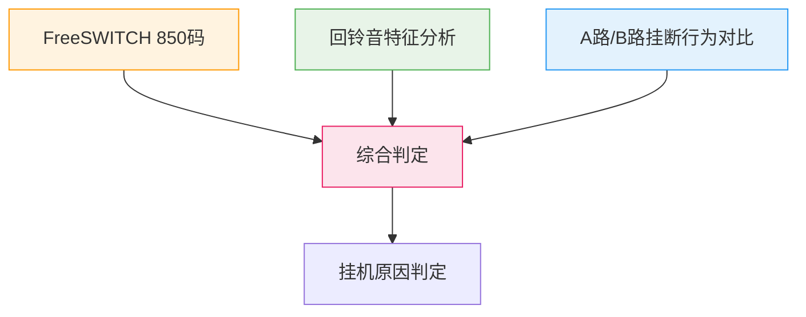
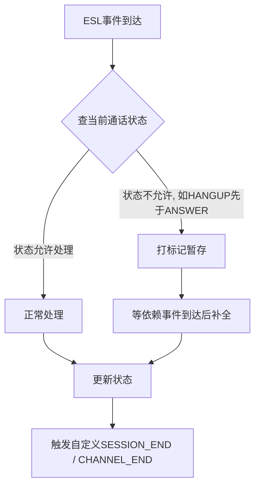

# 呼叫中心话务服务自研实践：三个最难啃的骨头

去年年中，公司用的第三方呼叫中心系统快到期了，决定自研。

我接手了话务服务这条线——负责把每通电话从振铃到挂断的全过程数据采下来，存好，再推给下游的业务系统。

说起来简单，做起来"坑"是真的多。这里挑三个印象最深的聊聊。

---

## 🏗️ 技术背景

| 项目 | 信息 |
|------|------|
| 通话引擎 | **FreeSWITCH** |
| 事件通道 | ESL（Event Socket Layer） |
| 核心数据 | 通话 CDR、录音、挂机原因 |
| 下游推送 | 消息总线 → 业务系统 |
| 数据敏感性 | 直接关系客服/销售业绩核算 |

---

## 一、挂机原因到底是谁挂的？

这是我觉得最难的一个问题。

一通电话结束，你得知道：是坐席挂的？客户挂的？还是线路断了？每通电话都涉及客服的业绩考核，错了会扣钱，所以**必须准**。

FreeSWITCH 会给一个挂断原因码（SIP 850 码），但单独用这个码判断很不靠谱。比如网络闪断，FreeSWITCH 报的是 NORMAL_CLEARING（正常挂断），但实际是被断开的。你按正常挂断算，数据就不对。

我的做法是**三路信号综合分析**：

**第一路：看 FreeSWITCH 的 850 码本身。** 这个最直接，但准确率也就六成。

**第二路：听回铃音。** 没接通的情况（空号、关机、停机、占线），回铃音特征各不一样。通过音频特征判断未接通原因，比只看 SIP 码准得多。这一步主要覆盖"没接起来"的场景。

**第三路：对比坐席侧（A 路）和客户侧（B 路）的挂断行为。** 举个例子——A 路先挂而且通话有了一定时长，大概率是坐席挂的。如果 B 路振铃了但没接，那就是客户没接，不是坐席的问题。

三路信号综合下来，准确率比第三方系统高了不少。

但这个事情没有"完美解"，不同场景（转接、咨询、三方通话）的挂断逻辑都不一样，得逐个场景调。上线后还在持续修了几个版本才稳下来。

---

## 二、事件乱序：还没接通就先挂断了？

FreeSWITCH 的 ESL 事件是异步推过来的，**不保证顺序**。

我遇到过最离谱的情况：CHANNEL_HANGUP（挂断）事件比 CHANNEL_ANSWER（接通）先到。按到达顺序处理，就会出现"通话还没接通就挂断了"这种矛盾数据。

一开始我设计了一个严格的状态机——事件按 A→B→C→D 的顺序处理，乱序就报错。上线第一天就被打脸了 😂

后来改成**幂等设计**：事件来了就处理，但不管来几次、什么顺序，结果都一样。

具体做法是：
- 每个事件处理前先查一次当前通话状态，决定这个事件现在能不能处理
- 如果收到 HANGUP 时还没有 ANSWER 记录，打个标记存起来，等 ANSWER 事件到了再补全
- 新增了两个自定义事件（SESSION_END 和 CHANNEL_END）作为兜底——在通话真正结束的节点发出，防止事件丢失导致的数据永久缺漏

这套机制上线后，乱序导致的数据问题基本绝迹了。

---

## 三、数据丢了或错了，能快速修复吗？

通话数据直接关系到客服和销售的业绩核算，数据丢了不是小事。

最初上线时，出了问题只能查日志 → 定位问题 → 改代码 → 发版。一个流程走下来快则半天，慢则一天，业务方早就炸了。

后来我做了三件事：

### 全链路监控打点

每个关键节点——事件接收、DB 写入、消息推送——都打了监控。每分钟通话量、接通率、推送成功率、异常挂断率，超阈值就告警。**问题在业务方反馈之前就能发现。**

### 运维修复接口

直接在 Controller 层加了几个接口：
- 按 callId 重新推送某条话务数据
- 按时间段批量重推（指定起止时间，把那段时间的数据重新推送一遍）
- 重新触发录音转码

这些接口不需要发版，运维在后台就能操作。**现在数据出问题了，我第一反应不是打开 IDE，而是先调接口修，修完再慢慢查原因。**

### 链路日志追踪

每次事件处理都记录操作日志，格式是"谁、什么时候、对哪条数据、做了什么"。追溯问题时直接搜 callId 就能看到这条数据的完整处理链路。

---

## ✅ 话务服务自研 Checklist

- [ ] **挂机原因判断：多路信号综合分析？** 单靠 SIP 码不靠谱
- [ ] **事件乱序：幂等设计而非严格状态机？** 异步事件不保证顺序
- [ ] **自定义兜底事件：SESSION_END / CHANNEL_END？** 防止事件丢失导致数据缺漏
- [ ] **全链路监控打点：事件接收/DB写入/消息推送？** 超阈值自动告警
- [ ] **运维修复接口：按 callId 重推 / 按时间段批量重推？** 不需要发版就能修数据
- [ ] **链路日志追踪：callId 关联完整处理链路？** 追溯问题一搜即得

从第三方切到自研，过程确实不轻松。但切完之后最大的感受是：**以前被卡脖子的地方，现在都能自己搞了。**

数据不准？自己修。新场景要支持？自己加。出问题了？自己查。

这些踩过的坑和沉淀下来的经验，我觉得是比"替换了一个系统"更有价值的东西。
